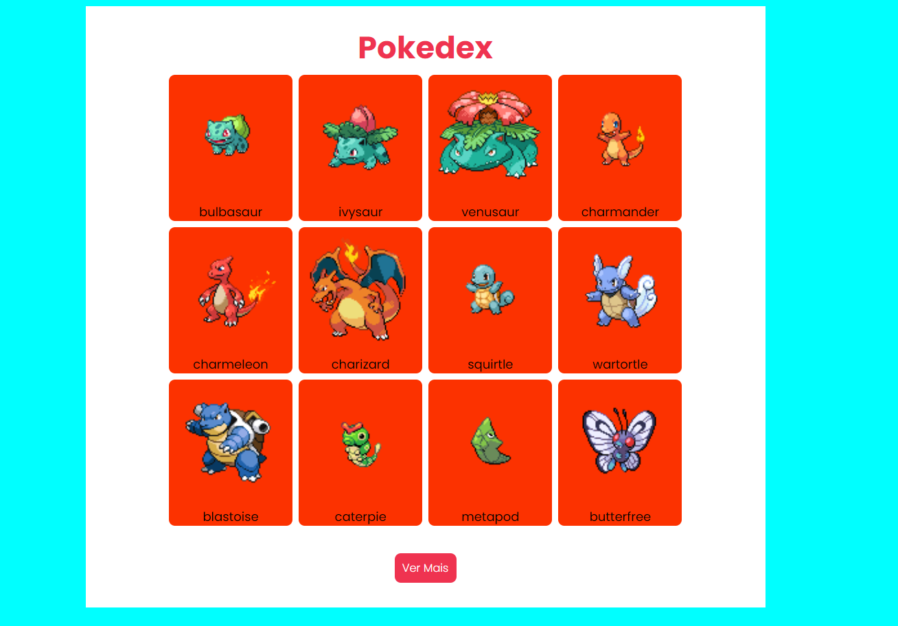

<h2>Pokedex Utilizando API Pokemon</h2>
<h5>
    Estudando APIS e como utilizar o fetch no javascript, e 
    executando requisições dentro de requisições
</h5>
<h3>Demonstração da aplicação</h3>

 
 
 
